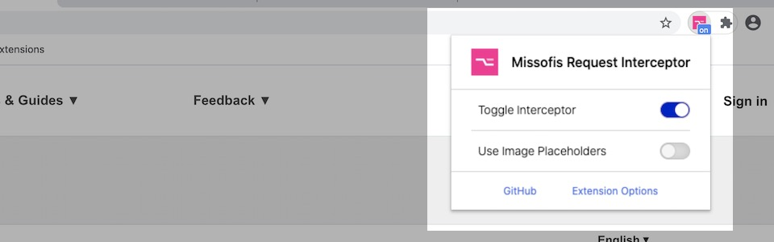
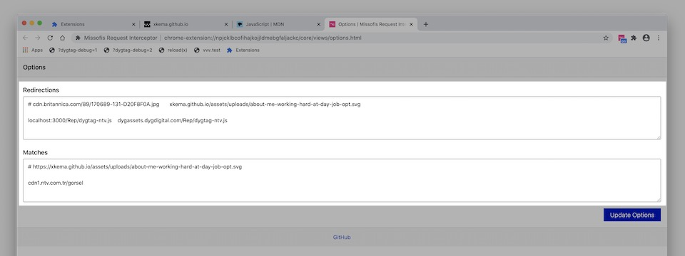

# User Documentation

User Documentation for Missofis Request Interceptor browser extension.

@todo: Add Chrome Web Store Link
@todo: Add Firefox Browser Add-Ons Store Link

## Popup Switches



Popup Switches are independent. They do not affect each other unless the incoming URL is intercepted and redirected before image blocking. In that case, no image blocking will occur.

Enabling one of them changes the popup button's status text from "off" to "on".

- [x] **Toggle Interceptor**: Toggles interceptor status. 
- [x] **Use Image Placeholders**: Toggles image blocking for matching URLs.

## Options Page



Use "Extension Options" link on the popup panel to open the options page. There are two text areas on the page. One is for redirections and the other one is for image blocking.

### Redirections

Redirections are right to left URL rewrites. Redirections should be formed as `string` + `space` + `string`.  Any number of spaces are welcome.

If you provide full URLs for both it looks like a redirection but it is a simple string replace. Some examples:

```bash
https://localhost:3000/my-script.js https://example.com/my-script.js

# With full URLs like above, right-hand side URL (example.com) will be redirected to left-hand side URL (localhost).
# But internally right-hand side string will be replaced with left-hand side.
```

This example will make it more clear:

```bash
localhost:3000/js/ example.com/scripts/

# If remote URL has scripts under the /scripts/ directory but they reside in the /js/ directory locally, you may use this.
# In this case "https://example.com/scripts/my-script.js" will be "https://localhost:3000/js/my-script.js".
```

### Matches

Matches are simpler. If incoming URL includes a listed string then it will be blocked.

Redirections should be formed as `string`

```bash
cdn.example.com/assets/images
cdn.example.com/assets/images/some-potato-image.js
potato

# First will block every image under a cdn URL.
# Second will block a specific potato image.
# Third will block every image including "potato" string in the URL.
```

---

Comments lines are welcome for all textareas. Use `#` sign to comment-out a line.

```bash
# localhost:3000/my-script.js example.com/my-script.js
# cdn.example.com/assets/images

# Both will be skipped.
```

Each line represents a single redirection or image block string.